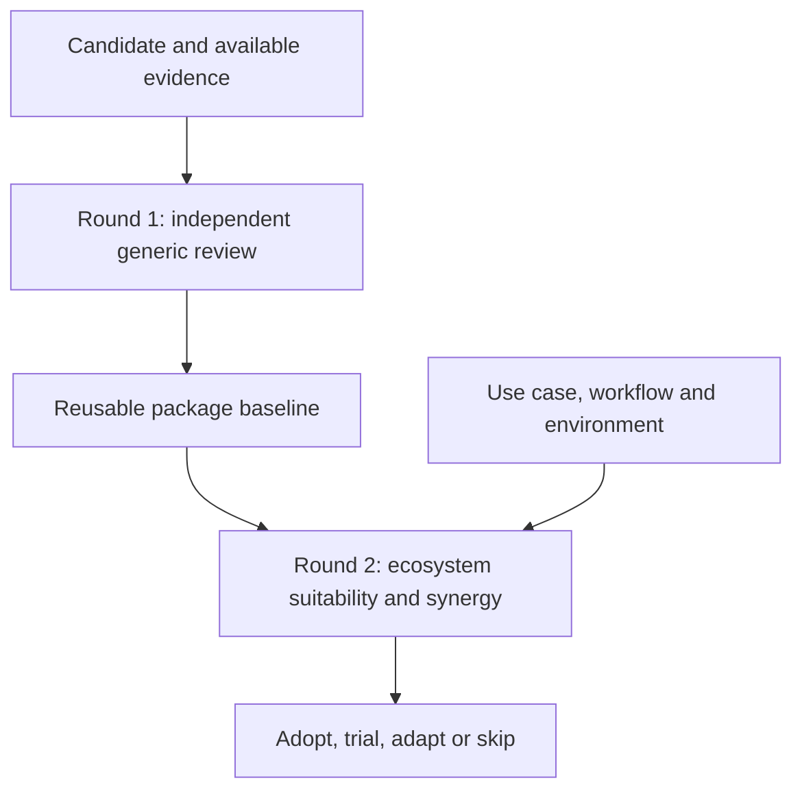

<a id="english"></a>

# Skill Evaluator

**Understand a skill on its own merits. Then decide whether it fits your work.**

[简体中文 ↓](#chinese) · [中文独立页面](README.zh-CN.md) · [Install](docs/INSTALLATION.md) · [Usage](docs/USAGE.md) · [Worked example](examples/two-users.md) · [Releases](https://github.com/TianjinAI/skill-evaluator/releases)

Skill Evaluator is a public, MIT-licensed agent skill for reviewing skills, plugins, and related tools. It separates package quality from personal suitability, supports evidence-backed comparisons, and gives you a clear adoption decision without inventing precision.

**Current version: 1.4.0.** The core instructions need no API key or Python dependency. An optional review-folder helper uses Python 3.10+ and the standard library.

## One intake, one complete report

For an open-ended evaluation, the agent asks the necessary scope/use-case questions **upfront**, reuses context already provided, and continues independent inspection while waiting. It then delivers the selected rounds together. Explicit generic-only requests need no personal questionnaire. Optional gaps become labeled assumptions or unknowns; new authorization or genuinely blocking discoveries can still require a question.

Standard/deep reviews now produce a **standalone HTML report** by default, with evidence links, separate scorecards, gates and test coverage. A brief chat response links to the actual file. Reports work offline and include print styling. Combined reports containing Round 2 stay private; the default renderer export excludes that section. HTML creation is not web publication. [HTML guide](references/html-delivery.md) · [Fictional layout input](examples/report-input.json)

> Evaluate this skill for replacing my current workflow. Ask any necessary questions upfront, then complete both rounds in one HTML report. Keep the generic assessment independent and mark what was not tested.

## Why two rounds?

A well-designed tool can be wrong for your environment. A convenient tool can still have a serious defect. Combining those judgments too early makes reviews inconsistent.



| | Round 1: generic screening/assessment | Round 2: ecosystem suitability and synergy |
|---|---|---|
| Main question | Does it credibly deliver its stated purpose? | Does it improve this user's actual work? |
| Inputs | Package, declared audience, implementation and evidence | Round 1 baseline plus user context and alternatives |
| Covers | Purpose, features, design, instruction quality, correctness, reliability, privacy, licensing, maintenance | Tasks, workflow, host/OS, data constraints, cost, autonomy, overlap and migration effort |
| Output | Strengths, findings, evidence limits and package readiness | Fit mapping, adoption decision, conditions and a useful next step |
| Independence | Can be completed and published on its own | References the baseline; does not rewrite facts to suit a preference |

For example, Mac-only support belongs in the generic scope assessment. Whether it rules out adoption for a Windows user belongs in Round 2. A broken export remains a defect for both users. See the [complete fictional example](examples/two-users.md).

## Round 2: Suitability and synergy with your agent-skill ecosystem

Round 1 evaluates the candidate generically, including its philosophy and architecture. Round 2 assesses how the candidate fits and improves **your use case and existing agent-skill ecosystem**: your agents, installed skills, tools and integrations, workflows, working environment and constraints. It examines task/output fit, complementary capabilities, useful handoffs, gaps it can fill, consolidation opportunities, operating costs and adoption effort. Overlap, duplication and potential conflicts are one part of this broader assessment. Synergy is a hypothesis until supported by an explicit handoff or task check; existing skills are not required to complete Round 2.

**This does not mean installing the candidate skill.** The installed-skill check is read-only. Installing the evaluator itself (see Quick start below) is a separate setup step; installing or activating any candidate requires your authorization and is not an automatic part of Round 2.

The reviewer starts with an available skill catalog, then reads only the relevant metadata/instructions within authorized scope. It distinguishes duplicate installs, functional substitutes, partial overlap, complementary capabilities and possible trigger conflicts. No whole-machine search, credentials, conversation history or automatic activation/removal is required. If inventory access is unavailable, it requests a sanitized list or marks coverage incomplete. [Overlap procedure](references/installed-skill-overlap.md)

A local read by a cloud-hosted agent may still enter the host provider's context. Respect approved-provider/offline constraints, and keep inventory details in private Round 2 notes. This is a review procedure, not a background scanner.

Suitability results show the actual checks and their outcomes. A static assessment without a representative user task is labeled **assessed only—suitability not task-validated**. Missing permissions or runtime yield a conditional conclusion, not an invented test pass.

## Quick start

Ask your skill-capable agent to install the complete repository:

**https://github.com/TianjinAI/skill-evaluator**

Then try:

> Use skill-evaluator to review this repository. Start with an independent generic review. Do not install the candidate.

For the second round:

> Now assess its fit for me using that baseline. I produce weekly client reports on Windows, want minimal interruptions, and can only send source data to approved providers.

For both:

> Evaluate these two skills independently, then compare them for my existing workflow. Keep generic defects separate from personal preferences and say what you actually tested.

Natural-language invocation works only if the host discovers the skill; explicit syntax varies by host. See [installation and WorkBuddy guidance](docs/INSTALLATION.md). A user-supplied WorkBuddy execution trace informed version 1.4.0; the revised workflow has not yet been rerun in WorkBuddy.

## What it does

- Reviews repository links, local packages, pasted skill instructions and release pages at the evidence level available.
- Separates the idea, implementation and demonstrated effectiveness.
- Checks ordinary operation and consequential failures, including false success and incomplete exports.
- Distinguishes publisher claims, source observations, local checks, end-to-end task validation and unknowns.
- Keeps severity separate from confidence; evaluates mandatory conditions without averaging away defects.
- Compares candidates and the current workflow on shared criteria.
- Reuses and updates baselines with explicit version tracking.
- Provides editable review templates, an evidence ledger and a pilot plan.

## Review the thinking and design, not only feasibility

Round 1 explicitly reconstructs the package's philosophy: values, empirical assumptions, heuristics, causal logic and openness to counterevidence. It then traces how those principles are implemented through routing, tools, state, validation and recovery, and evaluates alternatives and tradeoffs. A coherent doctrine may have a weak implementation; a technically sound implementation may enforce a flawed doctrine. These receive separate assessments. [Design and doctrine guide](references/design-and-doctrine.md)

## Category scores: 1–5

Standard/deep reviews include scored categories by default; screening can stay qualitative. Scores are anchored expert judgments, not objective measurements.

| Score | Meaning |
|---|---|
| 1 | Poor: material failure in the assessed scope |
| 2 | Weak: substantial gaps require remediation |
| 3 | Adequate: workable with meaningful limitations |
| 4 | Strong: well-supported, limited weaknesses |
| 5 | Excellent: exceptionally convincing within explicit boundaries |

Round 1 scores ten categories: purpose, philosophy, architecture, instructions, correctness, reliability, authority/privacy, evidence, efficiency/maintenance and incremental value. Round 2 has six separate fit categories for tasks, workflow/philosophy alignment, environment, data/authority, operating costs and value over alternatives.

Every score includes confidence, evidence, scope and rationale. **NE** means not enough evidence; **NA** means not applicable. Neither is converted to a midpoint. Mandatory failed gates still block the scoped adoption decision. No combined overall score is produced unless requested. [Full scoring anchors](references/scoring.md)

## Choose the effort, independently of the round

| Depth | Typical scope |
|---|---|
| Screening | Documentation and focused inspection; quick shortlist decision |
| Standard | Relevant source paths, dependencies, instructions and useful targeted checks |
| Deep | Behavioral trials, failure cases and matched comparisons when warranted and authorized |

A deep review is not automatically a penetration test, installation request or permission to use real accounts. Quick screening may stay inline; standard/deep reviews default to a local HTML report.

## Understand the verdict

Round 1 reports **ready for a bounded pilot**, **remediation needed**, **evidence insufficient**, or **unsuitable for its stated core purpose**.

Round 2 recommends **adopt**, **trial with conditions**, **adapt before use**, or **skip for this use case**.

Claims carry one of five evidence labels: **claimed**, **source-supported**, **locally checked**, **task-validated**, or **unknown**. Unknown is neither pass nor fail. A passed package check does not establish good judgment, correct sources or successful operation in your host.

## Optional review workspace

From the installed skill directory, create a draft in a new directory whose parent exists:

```sh
python3 scripts/init_review.py ./example-review --package "Example Package" --revision "v2.4" --rounds both
```

This creates separate generic and personal drafts, a CSV evidence ledger and a pilot worksheet. It refuses existing destinations, makes no network requests, and does not run the candidate. It does not evaluate anything automatically. [Template guide](templates/README.md)

## Package map

| Path | Purpose |
|---|---|
| [SKILL.md](SKILL.md) | Agent entrypoint, round selection, evidence and decision rules |
| [references/round-1.md](references/round-1.md) | Generic review rubric |
| [references/round-2.md](references/round-2.md) | User context and fit rubric |
| [references/evidence-practice.md](references/evidence-practice.md) | Findings, severity, confidence and testing discipline |
| [references/category-checks.md](references/category-checks.md) | Category-specific risks and checks |
| [references/comparison-and-reassessment.md](references/comparison-and-reassessment.md) | Comparisons, version changes and baseline reuse |
| [docs/USAGE.md](docs/USAGE.md) | Requests, outputs and practical workflow |
| [templates/](templates/README.md) | Copyable review artifacts |
| [examples/](examples/two-users.md) | Worked two-round example |
| [evals/](evals/README.md) | Behavioral evaluation protocol, not claimed benchmark results |

## Validation and limits

The package includes automated tests for both helpers, HTML escaping, export separation, score validation, overwrite protection and relative documentation links. Run them with:

```sh
python3 -m unittest discover -s tests -v
```

See [VALIDATION.md](VALIDATION.md) for the actual check record. Manual scenario walkthroughs and CI do not establish agent compliance or superior outcomes across models. This is a structured review method, not a security certification, investment adviser or legal opinion. The reviewer must still verify material facts and stay within its host's authorization rules.

The package adds no telemetry or background service. Your host and tools still determine where prompts and files are processed. Keep personal Round 2 records private unless their publication is authorized. [Security and privacy](SECURITY.md)

## Contribute and reuse

[Contributing](CONTRIBUTING.md) · [Changelog](CHANGELOG.md) · [Issues](https://github.com/TianjinAI/skill-evaluator/issues) · [MIT license](LICENSE)

Contributions should improve an actual review decision with evidence or a reproducible scenario. Public examples use fictional or sanitized inputs. The skill is host-neutral; product-specific integrations are documented only to the extent tested.

---

<a id="chinese"></a>

# 中文说明：Skill Evaluator 技能评估器

**先独立评价工具本身，再判断它是否适合你。**

[English ↑](#english) · [中文独立页面](README.zh-CN.md) · [安装指南](docs/INSTALLATION.md) · [使用指南](docs/USAGE.md) · [版本下载](https://github.com/TianjinAI/skill-evaluator/releases)

这是一个公开、MIT 许可的 Agent Skill，用于评估技能、插件及相关应用。当前版本 **1.4.0**。核心指令不需要 API Key 或额外运行库；可选的评估目录生成器需要 Python 3.10+。

## 一次前置澄清，一次完整交付

开放式评估先集中询问必要的用途、流程和环境问题，复用已有上下文；等待回答时可以继续独立查阅。随后一次交付所选两轮，避免第一轮输出后再开始常规问卷。明确只要通用评估时不问个人问题。非关键缺口标注假设或 NE；新的必要授权或真正阻塞问题仍可询问。

标准/深入评估默认生成可离线阅读和打印的 **HTML 报告**，聊天只给简短结论和文件链接。两轮评分卡、证据、必要条件和实际测试覆盖分别展示。默认导出只有通用第一轮；包含第二轮时明确标记私人内容，不自动公开。详见 [HTML 交付](references/html-delivery.md)。

> 请评估这个技能能否替换我的现有工作流。必要问题在开始时集中问，然后一次交付完整的两轮 HTML 报告，明确证据等级和未测试项。

## 两轮明确分开

| | 第一轮：独立通用评估 | 第二轮：用户生态适配与协同评估 |
|---|---|---|
| 核心问题 | 工具能否可信地完成它宣称的用途？ | 它是否值得用于这位用户的实际工作？ |
| 依据 | 声明的用户群、功能、设计、源码、测试和证据 | 第一轮基线，加上用户任务、流程、环境和约束 |
| 关注点 | 指令质量、正确性、可靠性、权限、隐私、成本、许可和维护 | 主机/系统兼容、工作流、自主性、已有工具、迁移成本和投入产出 |
| 结论 | 可进行有限试用／需要修复／证据不足／不适合其核心用途 | 采用／附条件试用／改造后使用／不适合此场景 |

第一轮可以单独完成并公开。第二轮引用第一轮，不为了迎合偏好改写客观发现。只支持 Mac 是通用范围限制；对 Windows 用户不可用是适配结论。导出丢页则是两种用户都需要面对的缺陷。

## 设计、架构与底层理念

第一轮不仅检查能不能运行，还分析作者的核心主张、价值取向、经验假设、因果逻辑和适用边界，检查是否接受反例与修正。再追踪这些理念如何落实到指令、工具、状态、验证和恢复机制，比较设计取舍。理念合理但实现薄弱，或实现稳健但理念偏颇，应分别指出。详见 [设计与理念](references/design-and-doctrine.md)。

## 各大类采用 1–5 分

标准及深入评估默认给分类分数：1 差、2 较弱、3 合格、4 强、5 优秀。第一轮十类包括目标、理念、架构、指令、正确性、可靠性、权限隐私、证据、效率维护和增量价值。第二轮另评任务、流程理念适配、环境、数据权限、成本和相对现有方案的价值。

每个分数需给出证据、置信度、评估范围和理由。证据不足记 NE，不适用记 NA，不机械打中间分。必要条件失败不能被高平均分掩盖；两轮不合并成一个分数。分数是有锚点的专业判断，不是假装客观测量。详见 [评分标准](references/scoring.md)。

## 第二轮：用户 Agent 技能生态的适配与协同评估

第一轮是通用筛查与评估；第二轮考察候选技能是否适合并能改善用户现有的 Agent 技能生态，包括 Agent、已安装技能、工具与集成、工作流程、运行环境和约束。评估任务与产出适配、能力互补、流程衔接、能力缺口、整合机会、运行成本和采用代价。重复、重叠及冲突检查只是其中一部分。协同收益需要具体的衔接或任务检查来支持；没有已安装技能也可以进行第二轮评估。

**这里指只读检查已经安装的技能，不是替用户安装候选技能。** 安装评估器本身是下文的独立设置步骤；安装或启用任何被评估候选都需要用户授权，不是第二轮的自动操作。

优先使用主机已提供的技能目录，仅在授权范围内读取相关名称、描述和必要的指令。无需读取密钥、聊天记录或全盘扫描，也不会自动执行、卸载或修改技能。无法读取目录时，可使用用户提供的脱敏清单，并标明检查范围不完整。详见 [重叠检查](references/installed-skill-overlap.md)。

只读不等于全程离线：云端 Agent 读取的文字可能进入其服务商上下文，应遵守用户对数据和服务商的限制。清单保留在私人第二轮材料中，不自动公开。

第二轮明确记录实际检查及结果。如果没有运行代表性任务，只能标注“已评估，适用性尚未经任务验证”，不能把静态判断称作测试通过。

## 安装与使用

把仓库地址交给支持技能安装的 Agent：

**https://github.com/TianjinAI/skill-evaluator**

要求保留完整目录，特别是 `SKILL.md`、`references/`、`templates/` 与 `scripts/`。已存在同名技能时先保留自定义修改。可从 Releases 下载带校验值的 ZIP。不同主机的安装位置不同；1.4.0 已参考用户提供的 WorkBuddy 执行记录改进；新版尚未在 WorkBuddy 复跑，详见安装指南。

第一轮示例：

> 使用 skill-evaluator 评估这个仓库。先做独立通用审查，不安装被评估技能，明确哪些结论来自源码、哪些只是作者宣称。

第二轮示例：

> 在刚才的基线上做第二轮。我在 Windows 上每周制作客户报告，希望减少反复确认，资料只能交给获批服务商。请结合我现有的工作流给出建议。

同时评估两个工具：

> 分别做第一轮，再针对我的用途比较。不要把我的个人偏好当成工具的通用缺陷。

评估深度与轮次相互独立：快速筛查、标准审查或深入验证。深入验证并不自动授权安装、付费、账号写入或公开私人材料。

## 有哪些配套材料

- 详细方法：证据等级、严重程度与置信度、必要条件、比较与版本复评。
- 可编辑模板：两轮报告、CSV 证据记录、试用计划与实际结果。
- 完整虚构案例：同一通用基线，对两个用户产生不同适配结论。
- 可选目录生成脚本：只创建草稿，不联网、不执行候选、拒绝覆盖已有目录。
- 测试、CI、贡献指南、隐私说明与行为评测方案。

## 证据边界

区分「作者宣称」「源码支持」「本地检查」「端到端任务验证」「未知」。结构检查通过不代表建议正确，测试计划也不是测试结果。自动测试覆盖目录生成器和文档链接；跨 Agent 的行为效果仍需要实际验证。完整记录见 [VALIDATION](VALIDATION.md)。

公开第一轮前排除私人信息；第二轮资料默认按私人草稿管理。技能本身不添加遥测或后台服务，但主机、模型和工具仍有各自的数据处理方式。

欢迎提交带有实际场景和证据的改进。详见 [贡献指南](CONTRIBUTING.md)、[更新记录](CHANGELOG.md) 和 [MIT 许可](LICENSE)。详细方法文档以英文为主；评估输出遵循用户使用的语言。
