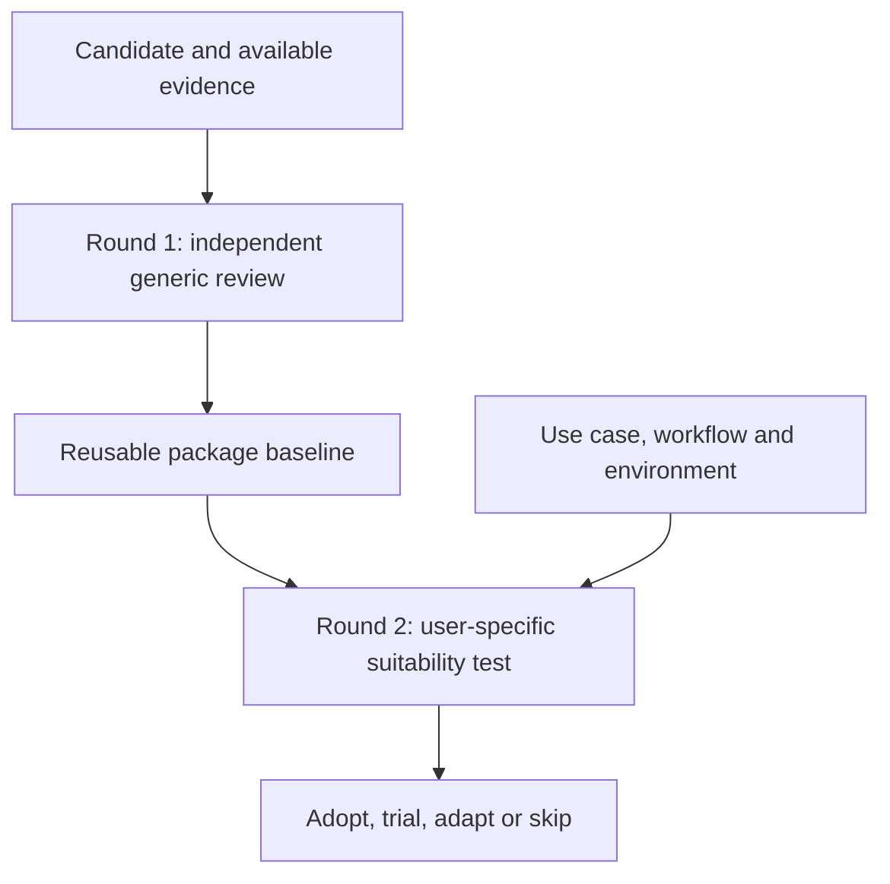

# Skill Evaluator

**Understand a skill on its own merits. Then decide whether it fits your work.**

[简体中文](README.zh-CN.md) · [Install](docs/INSTALLATION.md) · [Usage](docs/USAGE.md) · [Worked example](examples/two-users.md) · [Releases](https://github.com/TianjinAI/skill-evaluator/releases)

Skill Evaluator is a public, MIT-licensed agent skill for reviewing skills, plugins, and related tools. It separates package quality from personal suitability, supports evidence-backed comparisons, and gives you a clear adoption decision without inventing precision.

**Current version: 1.4.0.** The core instructions need no API key or Python dependency. An optional review-folder helper uses Python 3.10+ and the standard library.

## One intake, one complete report

For an open-ended evaluation, the agent asks the necessary scope/use-case questions **upfront**, reuses context already provided, and continues independent inspection while waiting. It then delivers the selected rounds together. Explicit generic-only requests need no personal questionnaire. Optional gaps become labeled assumptions or unknowns; new authorization or genuinely blocking discoveries can still require a question.

Standard/deep reviews now produce a **standalone HTML report** by default, with evidence links, separate scorecards, gates and test coverage. A brief chat response links to the actual file. Reports work offline and include print styling. Combined reports containing Round 2 stay private; the default renderer export excludes that section. HTML creation is not web publication. [HTML guide](references/html-delivery.md) · [Fictional layout input](examples/report-input.json)

> Evaluate this skill for replacing my current workflow. Ask any necessary questions upfront, then complete both rounds in one HTML report. Keep the generic assessment independent and mark what was not tested.

## Why two rounds?

A well-designed tool can be wrong for your environment. A convenient tool can still have a serious defect. Combining those judgments too early makes reviews inconsistent.



| | Round 1: generic screening/assessment | Round 2: suitability test |
|---|---|---|
| Main question | Does it credibly deliver its stated purpose? | Does it improve this user's actual work? |
| Inputs | Package, declared audience, implementation and evidence | Round 1 baseline plus user context and alternatives |
| Covers | Purpose, features, design, instruction quality, correctness, reliability, privacy, licensing, maintenance | Tasks, workflow, host/OS, data constraints, cost, autonomy, overlap and migration effort |
| Output | Strengths, findings, evidence limits and package readiness | Fit mapping, adoption decision, conditions and a useful next step |
| Independence | Can be completed and published on its own | References the baseline; does not rewrite facts to suit a preference |

For example, Mac-only support belongs in the generic scope assessment. Whether it rules out adoption for a Windows user belongs in Round 2. A broken export remains a defect for both users. See the [complete fictional example](examples/two-users.md).

## Round 2 checks skills you already have installed

Round 1 evaluates the candidate generically, including its philosophy and architecture. Round 2 tests its suitability for **your use case, workflow and environment**. As part of that review, it screens skills you already have installed for overlap, duplication, complementary capabilities and potential conflicts.

**This does not mean installing the candidate skill.** The installed-skill check is read-only. Installing the evaluator itself (see Quick start below) is a separate setup step; installing or activating any candidate requires your authorization and is not an automatic part of Round 2.

The reviewer starts with an available skill catalog, then reads only the relevant metadata/instructions within authorized scope. It distinguishes duplicate installs, functional substitutes, partial overlap, complementary capabilities and possible trigger conflicts. No whole-machine search, credentials, conversation history or automatic activation/removal is required. If inventory access is unavailable, it requests a sanitized list or marks coverage incomplete. [Overlap procedure](references/installed-skill-overlap.md)

A local read by a cloud-hosted agent may still enter the host provider's context. Respect approved-provider/offline constraints, and keep inventory details in private Round 2 notes. This is a review procedure, not a background scanner.

Suitability results show the actual checks and their outcomes. A static assessment without a representative user task is labeled **assessed only—suitability not task-validated**. Missing permissions or runtime yield a conditional conclusion, not an invented test pass.

## Quick start

Ask your skill-capable agent to install the complete repository:

**https://github.com/TianjinAI/skill-evaluator**

Then try:

> Use skill-evaluator to review this repository. Start with an independent generic review. Do not install the candidate.

For the second round:

> Now assess its fit for me using that baseline. I produce weekly client reports on Windows, want minimal interruptions, and can only send source data to approved providers.

For both:

> Evaluate these two skills independently, then compare them for my existing workflow. Keep generic defects separate from personal preferences and say what you actually tested.

Natural-language invocation works only if the host discovers the skill; explicit syntax varies by host. See [installation and WorkBuddy guidance](docs/INSTALLATION.md). A user-supplied WorkBuddy execution trace informed version 1.4.0; the revised workflow has not yet been rerun in WorkBuddy.

## What it does

- Reviews repository links, local packages, pasted skill instructions and release pages at the evidence level available.
- Separates the idea, implementation and demonstrated effectiveness.
- Checks ordinary operation and consequential failures, including false success and incomplete exports.
- Distinguishes publisher claims, source observations, local checks, end-to-end task validation and unknowns.
- Keeps severity separate from confidence; evaluates mandatory conditions without averaging away defects.
- Compares candidates and the current workflow on shared criteria.
- Reuses and updates baselines with explicit version tracking.
- Provides editable review templates, an evidence ledger and a pilot plan.

## Review the thinking and design, not only feasibility

Round 1 explicitly reconstructs the package's philosophy: values, empirical assumptions, heuristics, causal logic and openness to counterevidence. It then traces how those principles are implemented through routing, tools, state, validation and recovery, and evaluates alternatives and tradeoffs. A coherent doctrine may have a weak implementation; a technically sound implementation may enforce a flawed doctrine. These receive separate assessments. [Design and doctrine guide](references/design-and-doctrine.md)

## Category scores: 1–5

Standard/deep reviews include scored categories by default; screening can stay qualitative. Scores are anchored expert judgments, not objective measurements.

| Score | Meaning |
|---|---|
| 1 | Poor: material failure in the assessed scope |
| 2 | Weak: substantial gaps require remediation |
| 3 | Adequate: workable with meaningful limitations |
| 4 | Strong: well-supported, limited weaknesses |
| 5 | Excellent: exceptionally convincing within explicit boundaries |

Round 1 scores ten categories: purpose, philosophy, architecture, instructions, correctness, reliability, authority/privacy, evidence, efficiency/maintenance and incremental value. Round 2 has six separate fit categories for tasks, workflow/philosophy alignment, environment, data/authority, operating costs and value over alternatives.

Every score includes confidence, evidence, scope and rationale. **NE** means not enough evidence; **NA** means not applicable. Neither is converted to a midpoint. Mandatory failed gates still block the scoped adoption decision. No combined overall score is produced unless requested. [Full scoring anchors](references/scoring.md)

## Choose the effort, independently of the round

| Depth | Typical scope |
|---|---|
| Screening | Documentation and focused inspection; quick shortlist decision |
| Standard | Relevant source paths, dependencies, instructions and useful targeted checks |
| Deep | Behavioral trials, failure cases and matched comparisons when warranted and authorized |

A deep review is not automatically a penetration test, installation request or permission to use real accounts. Quick screening may stay inline; standard/deep reviews default to a local HTML report.

## Understand the verdict

Round 1 reports **ready for a bounded pilot**, **remediation needed**, **evidence insufficient**, or **unsuitable for its stated core purpose**.

Round 2 recommends **adopt**, **trial with conditions**, **adapt before use**, or **skip for this use case**.

Claims carry one of five evidence labels: **claimed**, **source-supported**, **locally checked**, **task-validated**, or **unknown**. Unknown is neither pass nor fail. A passed package check does not establish good judgment, correct sources or successful operation in your host.

## Optional review workspace

From the installed skill directory, create a draft in a new directory whose parent exists:

```sh
python3 scripts/init_review.py ./example-review --package "Example Package" --revision "v2.4" --rounds both
```

This creates separate generic and personal drafts, a CSV evidence ledger and a pilot worksheet. It refuses existing destinations, makes no network requests, and does not run the candidate. It does not evaluate anything automatically. [Template guide](templates/README.md)

## Package map

| Path | Purpose |
|---|---|
| [SKILL.md](SKILL.md) | Agent entrypoint, round selection, evidence and decision rules |
| [references/round-1.md](references/round-1.md) | Generic review rubric |
| [references/round-2.md](references/round-2.md) | User context and fit rubric |
| [references/evidence-practice.md](references/evidence-practice.md) | Findings, severity, confidence and testing discipline |
| [references/category-checks.md](references/category-checks.md) | Category-specific risks and checks |
| [references/comparison-and-reassessment.md](references/comparison-and-reassessment.md) | Comparisons, version changes and baseline reuse |
| [docs/USAGE.md](docs/USAGE.md) | Requests, outputs and practical workflow |
| [templates/](templates/README.md) | Copyable review artifacts |
| [examples/](examples/two-users.md) | Worked two-round example |
| [evals/](evals/README.md) | Behavioral evaluation protocol, not claimed benchmark results |

## Validation and limits

The package includes automated tests for both helpers, HTML escaping, export separation, score validation, overwrite protection and relative documentation links. Run them with:

```sh
python3 -m unittest discover -s tests -v
```

See [VALIDATION.md](VALIDATION.md) for the actual check record. Manual scenario walkthroughs and CI do not establish agent compliance or superior outcomes across models. This is a structured review method, not a security certification, investment adviser or legal opinion. The reviewer must still verify material facts and stay within its host's authorization rules.

The package adds no telemetry or background service. Your host and tools still determine where prompts and files are processed. Keep personal Round 2 records private unless their publication is authorized. [Security and privacy](SECURITY.md)

## Contribute and reuse

[Contributing](CONTRIBUTING.md) · [Changelog](CHANGELOG.md) · [Issues](https://github.com/TianjinAI/skill-evaluator/issues) · [MIT license](LICENSE)

Contributions should improve an actual review decision with evidence or a reproducible scenario. Public examples use fictional or sanitized inputs. The skill is host-neutral; product-specific integrations are documented only to the extent tested.
